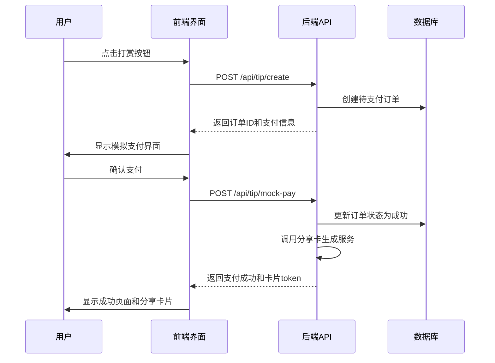

# 星座网站规划

## 一、项目概述

我要做一个“根据生日自动判断星座并生成当日运势”的网站。

### 目标用户
- 中国大陆用户
- 手机网页优先
- 泛娱乐用户

### V1 产品定位
这是一个轻量、低门槛、以娱乐体验为主的星座运势网站。
用户输入生日后，系统自动判断星座，并直接展示**今日完整版运势**。
用户无需注册登录即可直接使用，历史记录将直接保存在本地。
网站不采用“付费解锁报告”模式，而是采用**自愿打赏**模式。
用户打赏成功后，可生成专属**感谢卡片 / 分享图**。

---

## 二、V1 核心规则

### 已确认的产品规则
- V1 **只需要生日**，不需要性别字段
- V1 **只做今日运势**
- 用户输入生日后，直接展示**完整版今日运势**
- 运势内容篇幅约 **500～600 字**
- 同一星座同一天的**主内容一致**
- 保留少量轻量个性化差异
- 个性化基于**生日具体日期**
- 内容生产方式：**模板规则为主，AI 润色为辅**
- 用户**无需注册或登录**即可使用
- 历史记录：
  - 直接保存在用户本地浏览器（`localStorage`）中
- 支付采用**自愿打赏**模式，不影响内容访问权限
- 打赏金额支持：
  - 预设金额：`0.99 / 2.99 / 6.66 / 9.99`
  - 自定义金额
- 打赏采用匿名模式，不强制绑定账号
- 打赏成功后生成**专属分享图 / 感谢卡片**
- 若当日内容尚未生成，则展示：
  - `今日内容准备中，请稍后再试`

### 星座判断规则
采用国际通用的星座日期范围：

| 星座 | 日期范围 | 示例 |
|------|----------|------|
| 白羊座 | 3月21日 - 4月19日 | 3月21日, 4月15日 |
| 金牛座 | 4月20日 - 5月20日 | 4月20日, 5月18日 |
| 双子座 | 5月21日 - 6月21日 | 5月21日, 6月15日 |
| 巨蟹座 | 6月22日 - 7月22日 | 6月22日, 7月15日 |
| 狮子座 | 7月23日 - 8月22日 | 7月23日, 8月15日 |
| 处女座 | 8月23日 - 9月22日 | 8月23日, 9月15日 |
| 天秤座 | 9月23日 - 10月23日 | 9月23日, 10月15日 |
| 天蝎座 | 10月24日 - 11月22日 | 10月24日, 11月15日 |
| 射手座 | 11月23日 - 12月21日 | 11月23日, 12月15日 |
| 摩羯座 | 12月22日 - 1月19日 | 12月22日, 1月15日 |
| 水瓶座 | 1月20日 - 2月18日 | 1月20日, 2月15日 |
| 双鱼座 | 2月19日 - 3月20日 | 2月19日, 3月15日 |

**边界处理**：包含起始日，不包含结束日。例如3月20日属于双鱼座，3月21日属于白羊座。

### 运势内容数据结构
每日运势由以下模块组成，总篇幅500～600字：

| 模块 | 字数范围 | 说明 |
|------|----------|------|
| 整体运势 | 150～200字 | 概括今日的总体能量场，对生活各方面的影响基调，以及核心建议 |
| 爱情运势 | 80～120字 | 针对单身和有伴侣者的不同提示，包含情感互动、桃花机会等 |
| 事业学业 | 80～120字 | 工作或学习中的状态、关键机遇、注意事项 |
| 健康状态 | 60～80字 | 身体能量、需要留意的部位或生活习惯建议 |
| 财运 | 60～80字 | 投资理财、消费倾向、意外收入等方面的提示 |
| 幸运数字 | 固定格式 | 1个数字（可基于规则生成，如日期运算） |
| 幸运颜色 | 固定格式 | 1种颜色（可基于规则生成，如星座代表色结合日期微调） |
| 速配星座 | 固定格式 | 1～2个星座（可基于当日星象规则确定） |
| 今日箴言 | 20～30字 | 一句鼓舞或提醒的话语（可基于模板+AI润色） |

### 个性化规则
**1. 星座第N天**
示例："今天是你在狮子座的 第15天"
计算方式：当前日期 - 星座起始日（考虑跨年情况）

**2. 生日特质（基于出生日期）**
- 1-10日出生：今日行动力较强，适合主动出击
- 11-20日出生：今日直觉灵敏，宜倾听内心声音
- 21-31日出生：今日合作运佳，多与人交流获益

**3. 动态因子（不影响主内容）**
- **访问时间**：根据上午/下午/晚上添加应景话语
- **随机种子**：基于日期和生日生成种子，微调表述（如颜色深浅）

### 内容生成与润色流程
```mermaid
graph TD
    A[每日凌晨 00:05] --> B[为每个星座生成主内容模板]
    B --> C[调用AI进行统一润色]
    C --> D[存储润色后内容到数据库]

    E[用户请求运势] --> F{检查今日内容是否已生成}
    F -->|是| G[读取对应星座的润色内容]
    F -->|否| H[返回"内容准备中"]
    G --> I[填充个性化占位符]
    I --> J[返回完整运势内容]
```

**AI润色时机**：每日凌晨对每个星座的主内容进行一次统一润色，润色后的内容作为当日固定版本存储。

---

## 三、用户流程

### 主流程
1. 用户进入首页
2. 输入生日（YYYY-MM-DD格式）
3. 系统根据生日自动判断星座
4. 展示今日完整版运势
5. 系统自动将本次查询结果及生日记录保存在本地浏览器
6. 用户可自愿打赏支持站点
7. 打赏成功后，系统生成感谢卡片 / 分享图
8. 用户可随时查看保存在本地的历史测算记录

### 支付流程（模拟）


### 错误处理与用户体验

**1. 生日输入验证**
- **格式要求**：YYYY-MM-DD（例如 1995-03-21）
- **无效输入处理**：
  - 场景1：无法解析的格式（如"1995.03.21"）
    - 提示："请输入有效的日期格式，例如 1995-03-21"
  - 场景2：不存在的日期（如 02-30、13-01）
    - 提示："日期不存在，请重新输入"
  - 视觉样式：红色文字，字号略小于输入框，配合⚠️图标

**2. 加载状态**
- **布局**：与最终运势展示区域大小一致
- **内容**：
  - 顶部：星座图标占位（灰色圆形 + 短条）
  - 中部：4～5个灰色矩形条，宽度不同模拟段落
  - 底部：旋转加载图标或小星星闪烁动画
- **文案**："正在解读今日星象..."
- **动画**：占位块添加淡入淡出脉冲效果

**3. 异常状态**
- **内容未生成**：显示"今日内容准备中，请稍后再试"
- **网络错误**：显示"网络连接异常，请稍后重试" + 重试按钮
- **服务器错误**：显示"服务暂时不可用，请稍后再试"

---

## 四、技术栈与架构

### 技术栈
- **前端框架**：Next.js 14+（App Router）
- **开发语言**：TypeScript
- **样式系统**：Tailwind CSS
- **ORM工具**：Prisma
- **数据库**：PostgreSQL
- **AI服务**：OpenAI API 或 Anthropic Claude API

### 部署架构
| 组件 | 技术方案 | 说明 |
|------|----------|------|
| **应用托管** | Vercel | 自动部署、CDN、Serverless Functions |
| **数据库** | Supabase | PostgreSQL托管，含连接池和备份 |
| **文件存储** | Vercel Blob | 分享卡片图片存储 |
| **定时任务** | Vercel Cron Jobs | 每日凌晨触发运势生成脚本 |
| **环境变量** | Vercel Environment Variables | 敏感配置管理 |

### 环境变量配置
```bash
# 数据库连接
DATABASE_URL="postgresql://..."

# AI服务
OPENAI_API_KEY="sk-..."
# 或
ANTHROPIC_API_KEY="sk-ant-..."

# 应用配置
NEXT_PUBLIC_APP_URL="https://your-app.vercel.app"
NEXT_PUBLIC_GA_ID="UA-..." # 可选：Google Analytics

# 支付配置（模拟）
NEXT_PUBLIC_MOCK_PAYMENT_ENABLED="true"
```

---

## 五、数据模型设计（Prisma Schema）

### 核心数据表
```prisma
// 每日运势内容
model FortuneContent {
  id        String   @id @default(cuid())
  date      DateTime @unique // 日期（仅日期部分）
  zodiac    ZodiacSign // 星座
  content   Json     // 运势内容（JSON结构）
  aiRefined Boolean @default(false) // 是否已AI润色
  createdAt DateTime @default(now())
  updatedAt DateTime @updatedAt

  @@index([date, zodiac])
}

// 打赏订单
model TipOrder {
  id          String   @id @default(cuid())
  orderId     String   @unique // 订单号
  amount      Decimal  // 金额
  currency    String   @default("CNY")
  status      OrderStatus @default(PENDING)
  isAnonymous Boolean @default(true) // 是否匿名
  metadata    Json?    // 附加信息
  token       String?  @unique // 分享卡访问token
  createdAt   DateTime @default(now())
  updatedAt   DateTime @updatedAt

  @@index([createdAt])
  @@index([status])
}

// 分享卡片
model ShareCard {
  id        String   @id @default(cuid())
  token     String   @unique
  orderId   String   @unique
  imageUrl  String   // 图片存储地址
  expiresAt DateTime // 过期时间
  viewCount Int      @default(0) // 查看次数
  createdAt DateTime @default(now())

  @@index([token])
  @@index([expiresAt])
}

// 枚举类型
enum ZodiacSign {
  ARIES       // 白羊座
  TAURUS      // 金牛座
  GEMINI      // 双子座
  CANCER      // 巨蟹座
  LEO         // 狮子座
  VIRGO       // 处女座
  LIBRA       // 天秤座
  SCORPIO     // 天蝎座
  SAGITTARIUS // 射手座
  CAPRICORN   // 摩羯座
  AQUARIUS    // 水瓶座
  PISCES      // 双鱼座
}

enum OrderStatus {
  PENDING    // 待支付
  PROCESSING // 处理中
  SUCCESS    // 成功
  FAILED     // 失败
  CANCELLED  // 取消
}
```

---

## 六、项目目录结构

```bash
app/
  page.tsx                    # 首页（生日输入 + 运势展示）
  history/page.tsx            # 历史记录页面
  tip/
    success/[token]/page.tsx  # 打赏成功页面
  card/
    [token]/page.tsx          # 分享卡片查看页面

  api/
    fortune/
      today/route.ts          # 获取今日运势
      generate/route.ts       # 管理员：手动生成运势

    tip/
      create/route.ts         # 创建打赏订单
      mock-pay/route.ts       # 模拟支付回调
      status/route.ts         # 查询订单状态
      callback/route.ts       # 支付回调（预留）

    share-card/
      generate/route.ts       # 生成分享卡片
      [token]/route.ts        # 获取卡片信息

components/
  ui/                         # 基础UI组件
    button.tsx
    input.tsx
    card.tsx
    dialog.tsx

  BirthdayForm.tsx            # 生日输入表单
  FortuneResult.tsx           # 运势结果展示
  FortuneSection.tsx          # 运势模块组件
  TipPanel.tsx                # 打赏面板
  TipAmountSelector.tsx       # 金额选择器
  HistoryList.tsx             # 历史记录列表
  ShareCardPreview.tsx        # 分享卡片预览
  LoadingSkeleton.tsx         # 加载骨架屏

lib/
  zodiac.ts                   # 星座判断逻辑
  birthday.ts                 # 生日处理工具
  personalization.ts          # 个性化规则
  local-history.ts            # localStorage历史管理
  amount.ts                   # 金额格式化
  validator.ts                # 输入验证
  date-utils.ts               # 日期工具
  random-seed.ts              # 随机种子生成

server/
  fortune-service.ts          # 运势服务
  tip-service.ts              # 打赏服务
  share-card-service.ts       # 分享卡服务
  ai-service.ts               # AI润色服务

prisma/
  schema.prisma              # 数据模型定义
  migrations/                # 数据库迁移
  seed.ts                    # 种子数据

scripts/
  generate-daily-fortune.ts  # 每日运势生成脚本
  seed-template.ts           # 模板种子脚本
  cleanup-expired-cards.ts   # 清理过期卡片

public/
  images/
    zodiac/                  # 星座图标
    backgrounds/             # 背景图片
  icons/
  fonts/                     # 自定义字体

styles/
  globals.css               # 全局样式
  animations.css            # 动画定义
```

---

## 七、性能优化与安全

### 性能优化
1. **CDN缓存**：运势内容设置1小时缓存（`Cache-Control: public, max-age=3600`）
2. **图片优化**：
   - 使用Next.js Image组件自动优化
   - 分享卡片图片使用WebP格式
   - 懒加载非关键图片
3. **代码分割**：
   - 打赏组件和分享卡组件动态导入
   - 历史记录页面延迟加载
4. **数据库优化**：
   - 为常用查询字段添加索引
   - 使用连接池管理数据库连接

### 安全措施
1. **输入验证**：
   - 所有用户输入都进行严格验证和清理
   - 使用Zod进行schema验证
2. **API防护**：
   - 设置CORS策略
   - 实施请求频率限制
3. **数据安全**：
   - 数据库连接使用SSL
   - 敏感信息不记录日志
4. **支付安全**：
   - 订单金额服务端验证
   - 防止重复支付
5. **隐私保护**：
   - 生日数据不存储到服务端
   - 打赏订单匿名化处理
   - 明确隐私政策声明

---

## 八、开发路线图

### 阶段一：基础框架（Week 1-2）
- [ ] 初始化Next.js项目配置
- [ ] 设置Tailwind CSS和TypeScript
- [ ] 配置Prisma和Supabase连接
- [ ] 创建基础布局和页面结构
- [ ] 实现生日输入表单和验证

### 阶段二：核心功能（Week 3-4）
- [ ] 实现星座判断逻辑
- [ ] 创建运势展示组件
- [ ] 设计运势内容模板系统
- [ ] 实现localStorage历史记录
- [ ] 添加加载状态和错误处理

### 阶段三：内容系统（Week 5-6）
- [ ] 设计数据库模型和迁移
- [ ] 实现每日运势生成脚本
- [ ] 集成AI润色服务
- [ ] 创建内容管理界面（可选）
- [ ] 优化内容个性化规则

### 阶段四：支付与分享（Week 7-8）
- [ ] 实现打赏订单系统
- [ ] 创建模拟支付流程
- [ ] 开发分享卡片生成服务
- [ ] 集成图片生成（@vercel/og）
- [ ] 优化移动端支付体验

### 阶段五：优化部署（Week 9-10）
- [ ] 配置Vercel部署和Cron Jobs
- [ ] 设置环境变量和敏感信息
- [ ] 实施性能优化措施
- [ ] 添加分析和监控
- [ ] 完善文档和测试

### 阶段六：上线运营（Week 11+）
- [ ] 最终测试和Bug修复
- [ ] 生产环境部署
- [ ] 监控和日志设置
- [ ] 用户反馈收集
- [ ] 制定内容更新计划

---

## 九、运营与维护

### 内容更新策略
1. **模板迭代**：每月评估和更新运势模板
2. **AI提示词优化**：根据用户反馈调整润色提示词
3. **个性化规则扩展**：逐步增加个性化维度

### 数据分析指标
- **使用数据**：每日查询次数、用户留存率
- **内容数据**：各星座查询分布、停留时间
- **支付数据**：打赏转化率、平均金额
- **性能数据**：页面加载时间、API响应时间

### 用户反馈渠道
- **内置反馈**：页面底部添加反馈入口
- **社交媒体**：建立用户交流群
- **定期调研**：每季度进行用户满意度调查

---

## 十、附录

### API接口文档

#### 1. 获取今日运势
```
GET /api/fortune/today?birthday=1995-03-21
```

**响应示例**：
```json
{
  "success": true,
  "data": {
    "zodiac": "白羊座",
    "dayInCycle": 15,
    "fortune": {
      "overall": "今天整体运势...",
      "love": "爱情方面...",
      "career": "事业学业...",
      "health": "健康状态...",
      "wealth": "财运方面...",
      "luckyNumber": 7,
      "luckyColor": "红色",
      "matchedZodiac": ["狮子座", "射手座"],
      "saying": "今日箴言..."
    },
    "personalized": {
      "birthdayTrait": "今日行动力较强...",
      "timeGreeting": "上午好，新的一天开始啦！"
    }
  }
}
```

#### 2. 创建打赏订单
```
POST /api/tip/create
Content-Type: application/json

{
  "amount": 6.66,
  "currency": "CNY",
  "isAnonymous": true
}
```

### 故障处理预案
1. **数据库连接失败**：降级到静态运势内容
2. **AI服务不可用**：使用未润色的模板内容
3. **支付服务异常**：显示"打赏功能暂时维护中"
4. **CDN缓存失效**：回源到Vercel Edge Functions

---

**文档版本**：v2.0
**最后更新**：2026-03-14
**更新内容**：基于用户反馈完善星座规则、运势结构、支付流程、部署架构等技术细节